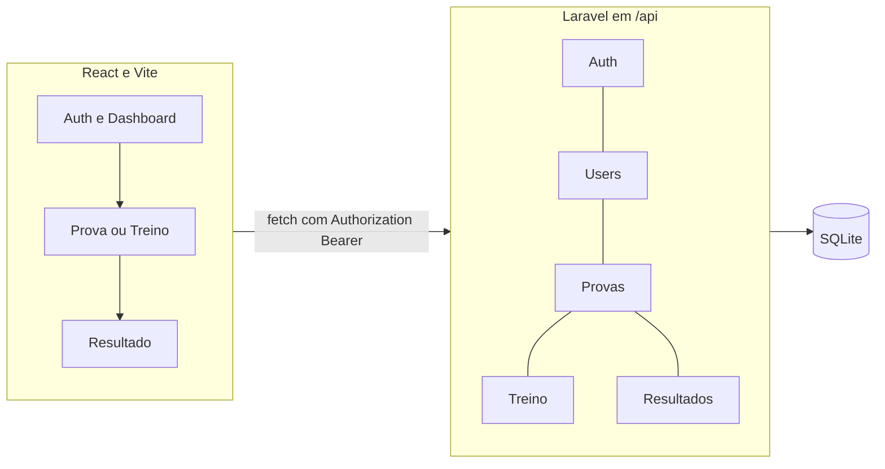

# 📚 ENEM.prática (monólito modular, Laravel + React)

Eu construí um simulador de provas ao estilo ENEM com **API Laravel**, **SPA React (Vite)** e **SQLite**. Organizei o backend em **módulos por domínio** (`app/Modules/*`) e evitei camadas extra que ainda não precisava.

---

## 🎯 Visão geral

| Aspeto | O que eu fiz |
|--------|----------------|
| **Arquitetura** | Escolhi monólito modular: Auth, Users, Provas, Treino, Resultados. Em cada módulo deixei `Routes`, `Http/Controllers`, `Http/Requests`, `Services` e `Models` quando fez sentido, e extraí serviços transversais para `app/Support` para reduzir acoplamento entre módulos. |
| **Rotas API** | Em `routes/api.php` importo os `Routes/api.php` de cada módulo. |
| **Provas vs treino** | No painel listo provas `simulado` e `ativas`. Uso o tipo `banco` para alimentar o sorteio do treino. |
| **Auth** | Password em hash + autenticação por **Bearer token** no guard `api` (`auth:api`). No cliente guardo o token no `localStorage` e envio `Authorization: Bearer <token>` nas rotas protegidas. |
| **Feedback** | Fiz a API devolver `feedback` (acerto e gabarito) ao responder, para modo estudo na interface. |
| **Menos idas ao servidor** | Uso `POST /api/provas/{id}/iniciar?expand=prova,questoes` para trazer sessão, prova e primeira página de questões na mesma resposta. |

---

## 🖼️ Ideia inicial e estrutura final

Eu mantive o mesmo percurso de negócio: entrar na conta, ver o painel, fazer prova ou treino e ver o resultado. **Alterei sobretudo a estrutura do código**: menos pastas e padrões pesados no primeiro passo, rotas com nomes claros e base de dados mais simples.

### Lado a lado

| Ideia inicial (rascunho) | Estrutura final (código) |
|--------------------------|---------------------------|
|  |  |
| Rotas genéricas para `questions` e módulo com muitos de Jobs, eventos e repositórios | Eu passei a rotas específicas para cada ação e pastas só com o essencial: controladores, serviços e modelos |
| Ideia de “caderno” com muitos campos à mão | Eu modelei uma **sessão de prova** com respostas em JSON e tabelas diretas: utilizadores, provas, questões, resultados |
| (não desenhado) | Interface em React: pastas `screens`, `hooks` e ficheiro `api.js` |

Guardei as figuras em `docs/images/ideia-inicial.png` e `docs/images/arquitetura-final-atualizada.svg`.

### Porque alterei a estrutura

**Tempo e clareza.** Inicialmente quis mostrar o fluxo completo (login, prova, resultado, treino) sem gastar tempo em camadas que eu não vejo no ecrã. Por isso não comecei com filas, repositórios e eventos.

**Rotas com sentido.** Eu escrevi cada URL para descrever uma ação concreta (por exemplo guardar resposta na prova ou pedir questão de treino). 

**Sessão em vez de “caderno” extra.** **Guardei o estado da prova** numa tabela de sessões com um mapa de respostas em JSON. Fiquei com menos tabelas e o mesmo comportamento.

**Login com token.** No login e registo eu emito um token, guardo apenas o hash em `users.api_token` e protejo rotas privadas com `auth:api`.

**Treino e simulado separados.** Eu reutilizei as mesmas questões na base; no simulado eu uso sessão e páginas, no treino uso sorteio. Separei as rotas para não misturar regras.

### Resumo rápido

| Rascunho | O que eu implementei |
|----------|----------------------|
| Módulo grande com Jobs e listeners | Deixei só o que precisava por módulo: rotas, controladores, serviços, modelos |
| Um CRUD para questões | Passei a várias rotas: listar questões, gravar resposta com `PUT`, finalizar prova, rotas de treino |
| Dashboard solto | Criei um `GET /dashboard` que envia provas e histórico num ecrã só |

### Diagrama lógico 



---

## 🛠 Stack

| Camada | Tecnologia |
|--------|------------|
| Backend | PHP 8.2+, Laravel 11 |
| Base de dados | SQLite (`pdo_sqlite`) |
| Frontend | React 18, Vite 6 |
| Estilos | Tailwind CSS 3, PostCSS |
| Testes API | PHPUnit 11 |
| Testes frontend | Vitest 3, Testing Library, jsdom |

---

## 📁 Estrutura (o essencial)

```
app/Modules/{Auth,Users,Provas,Treino,Resultados}/
  Routes/api.php
  Http/Controllers/
  Http/Requests/
  Services/
  Models/                    (quando aplicável)
app/Http/Requests/ApiFormRequest.php
app/Modules/Auth/Results/   
app/Support/
  DomainException.php
  ActiveProvasCatalog.php
  QuestaoRespostaEvaluator.php
app/Modules/Provas/Support/ 

resources/js/
  pages/App.jsx              
  screens/                   # Auth, Dashboard, Treino, Prova, Resultado
  hooks/                     # useAuthFlow, useNavigation, useProvaFlow, useTreinoFlow, useScopedAbort
  components/                # UI reutilizável
  __tests__/components/      # testes Vitest dos componentes
  api.js                     # fetch + Bearer token + suporte a AbortSignal

routes/api.php               # importar rotas de cada módulo
database/migrations
database/seeders             
tests/Feature, tests/Unit    # PHPUnit
```

**Serviços de destaque**

- **`ProvaFinalizacaoService`**: Extraí a correção, os totais por disciplina e a gravação do `Resultado` para aqui, à parte do resto de `ProvasService`.
- **`QuestaoApiPresenter`**: Unifiquei o formato JSON das questões na API (provas e treino).
- **`DetalheDisciplinasPresenter`**: Mapeio `detalhe_disciplinas` para o histórico e para o ecrã de resultado.
- **`ActiveProvasCatalog`**: Centralizei a listagem/detalhe de provas ativas para dashboard/API sem depender diretamente de `ProvasService`.
- **`QuestaoRespostaEvaluator`**: Reaproveitei a lógica de avaliação de alternativas (prova e treino) num serviço único, evitando duplicação entre módulos.
- **`DomainException`**: Passei a lançar exceções de domínio e mapear tudo no handler global para manter contrato de erro consistente.

**Frontend**

- Centralizei os pedidos em **`api()`**, com `Authorization: Bearer <token>` e, quando faz sentido, **`signal`** (`AbortController`) para cancelar ao mudar de ecrã e não atualizar a interface com dados velhos.
- Quando **tu** marcas uma alternativa, **eu não cancelo esse pedido** se só mudas de página no simulado: eu separei esse fluxo do cancelamento automático dos outros pedidos (`AbortController` só na navegação geral).
- Refatorei o fluxo principal para hooks de orquestração (**`useAuthFlow`** e **`useNavigation`**) e reduzi o volume de props passadas para as telas de prova/treino com objetos de `flow`.

---

## 💾 Pasta `storage`

Em runtime o Laravel escreve aqui logs, cache de framework, sessões, `storage/app`, etc. No `.gitignore` ignorei ficheiros gerados para não poluir o repositório.

---

## 🗄 Modelo de dados (SQLite)

Implementei o esquema nas migrações em `database/migrations/`, trato esse código como fonte.

### `users`

| Coluna | Notas |
|--------|--------|
| `id` | PK |
| `name`, `email` (unique), `password` (hash), `api_token` (hash, nullable, unique) | |
| `created_at`, `updated_at` | |

### `provas`

| Coluna | Notas |
|--------|--------|
| `titulo`, `status` | `ativo` para listagens |
| `tipo` | `simulado` no painel; `banco` para pool do treino |

### `questoes`

| Coluna | Notas |
|--------|--------|
| `prova_id` | FK |
| `disciplina`, `enunciado`, `fonte` | |
| `opcoes` | JSON: lista com `texto`, `correta` |

### `sessoes_prova`

| Coluna | Notas |
|--------|--------|
| `user_id`, `prova_id` | |
| `status` | por exemplo `em_andamento` depois `finalizada` |
| `respostas` | JSON com mapa de `questao_id` para o texto da opção escolhida |

### `resultados`

| Coluna | Notas |
|--------|--------|
| `sessao_id` | FK única |
| `total_questoes`, `total_acertos`, `percentual_acerto` | |
| `detalhe_disciplinas` | JSON com totais por disciplina |

---

## 🌐 Endpoints HTTP (prefixo `/api`)

Configurei o Laravel para prefixar `routes/api.php` com **`/api`**. Uso corpo JSON quando não digo o contrário.

Nas rotas protegidas, é necessário enviar o header **`Authorization: Bearer {token}`**. No login e no registo **eu devolvo** esse token; o backend guarda apenas o hash em `users.api_token`.

| Método | Caminho | Autenticação | Corpo / query |
|--------|---------|----------------|----------------|
| POST | `/api/auth/register` | Pública | `nome`, `email`, `senha` (mín. 8 caracteres com letras e números) |
| POST | `/api/auth/login` | Pública | `email`, `senha` |
| POST | `/api/auth/logout` | **Bearer token** | corpo vazio |
| POST | `/api/auth/esqueci-senha` | Pública | `email` |
| GET | `/api/dashboard` | **Bearer token** | corpo vazio |
| GET | `/api/minha-conta` | **Bearer token** | corpo vazio |
| GET | `/api/minha-conta/historico` | **Bearer token** | corpo vazio |
| GET | `/api/provas` | Pública | Lista dos simulados ativos (o que eu mostro no painel) |
| GET | `/api/provas/{id}` | Pública | corpo vazio |
| POST | `/api/provas/{id}/iniciar` | **Bearer token** | Query: `expand=prova,questoes`, `per_page` (máx. 3) |
| GET | `/api/provas/{id}/questoes` | Pública | Query: `page`, `per_page` |
| **PUT** | `/api/provas/{id}/questoes/{questao_id}/resposta` | **Bearer token** | `opcao_id` (índice) ou `resposta` (texto da alternativa). Com este `PUT` **atualizas** a resposta na sessão, seja a primeira marcação ou uma correção. |
| POST | `/api/provas/{id}/finalizar` | **Bearer token** | corpo vazio |
| GET | `/api/treino/disciplinas` | Pública | corpo vazio |
| GET | `/api/treino/questao-aleatoria` | Pública | Query: `disciplina`, `excluir[]` |
| POST | `/api/treino/responder` | **Bearer token** | `questao_id`, `opcao_id` ou `resposta` |
| GET | `/api/resultados/{prova_id}` | **Bearer token** | Último resultado dessa prova para o teu utilizador |
| GET | `/up` | Pública | Health check (Laravel) que usei para ver se o servidor responde |

### 📤 Formato de respostas e erros

Eu normalizei os erros da API para facilitar tratamento no frontend. Hoje os erros de domínio também seguem este mesmo envelope (via `DomainException` no handler global).

- **Erros de validação (`422`)**: retornam `message` e `error` com `code=VALIDATION_ERROR` e `details.fields`.
- **Erros HTTP (ex.: `401`, `404`)**: retornam `message` e `error` com `code=HTTP_{status}`.
- **Erro interno (`500`)**: retorna `message` e `error` com `code=INTERNAL_ERROR`.

Exemplo de erro de validação:

```json
{
  "message": "Dados invalidos.",
  "error": {
    "code": "VALIDATION_ERROR",
    "message": "Dados invalidos.",
    "details": {
      "fields": {
        "email": [
          "The email field is required."
        ]
      }
    }
  }
}
```

Comportamento de auth importante:

- `POST /api/auth/register`: exige senha com no mínimo 8 caracteres, incluindo letras e números.
- `POST /api/auth/esqueci-senha`: retorna `200` com `sent=true` quando encontra email, e `404` com `sent=false` quando o email não existe.

---

## 🚀 Como rodar o projeto

### Pré-requisitos

- **PHP 8.2+** com **pdo_sqlite**
- **Composer**
- **Node.js** + **npm**

Confirma no teu terminal: `php -v`, `composer -V`, `node -v`, `npm -v`.

### Passos (raiz do repositório)

**1. Dependências PHP**

```bash
composer install
```

**2. Ambiente**

Windows (PowerShell):

```powershell
Copy-Item .env.example .env
php artisan key:generate
```

Linux / macOS:

```bash
cp .env.example .env
php artisan key:generate
```

No `.env`, verifica se tens algo como `DB_CONNECTION=sqlite` e `DB_DATABASE=database/database.sqlite`.

**3. Ficheiro SQLite**

PowerShell:

```powershell
New-Item -ItemType File -Path database\database.sqlite -Force
```

bash:

```bash
touch database/database.sqlite
```

**4. Migrações + seed de demo**

```bash
php artisan migrate:fresh --seed
```

**5. Frontend**

```bash
npm install
```

**6. Dois terminais em desenvolvimento**

- **Terminal A (Laravel)**

```bash
php artisan serve
```

Abre no browser por exemplo `http://127.0.0.1:8000`.

- **Terminal B (Vite, hot reload)**

```bash
npm run dev
```

Com o Vite rodando, o Laravel aponta para o dev server (`public/hot`).

### 👤 Conta de demonstração

| Campo | Valor |
|-------|--------|
| E-mail | `maria@enem.dev` |
| Senha | `123456` |

> Nota: esta senha `123456` é apenas da conta demo inserida na base.
> Para novos registos via API, a senha deve ter no mínimo 8 caracteres e incluir letras e números (ex.: `Senha1234`).

### 📦 Só build de frontend (sem HMR)

```bash
npm run build
php artisan serve
```

### 🙈 Git

No `.gitignore` listei `vendor`, `node_modules`, `.env`, caches, `public/hot`, `public/build`, `database/*.sqlite` local, etc. Mantenho o **`.env.example`** no repositório como modelo.

---

## 🧪 Testes

| Alvo | Comando | Notas |
|------|---------|--------|
| **API (PHPUnit)** | `php vendor/bin/phpunit` ou `composer test` | Feature + Unit em `tests/` |
| **Frontend (Vitest)** | `npm run test` ou `npm run test:frontend` | Mesmo script: uma execução |
| **Frontend (watch)** | `npm run test:frontend:watch` | Reexecuta ao guardar ficheiros |

Eu coloquei os testes de componentes React em **`resources/js/__tests__/components/`**, com imports relativos para `components/...`.

---

