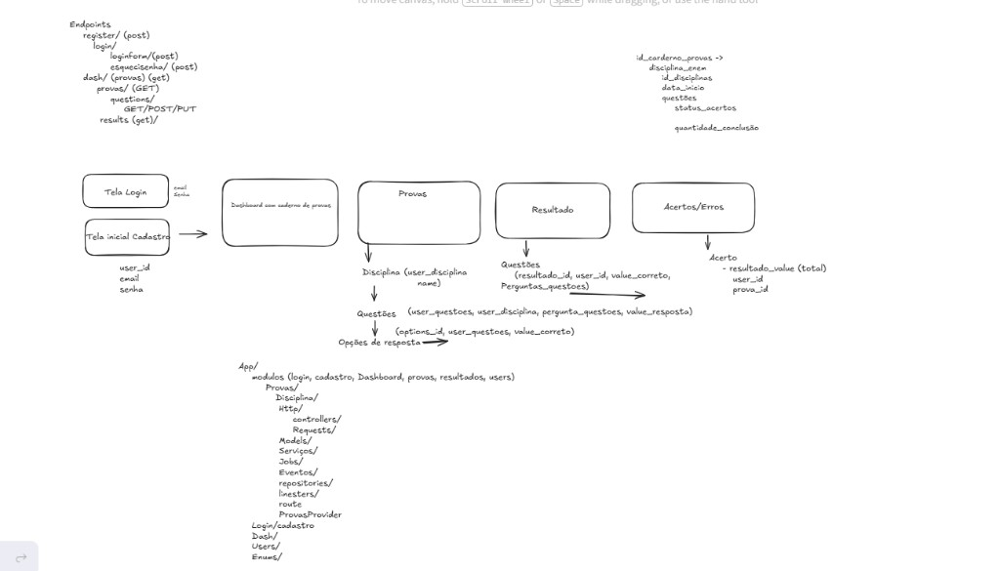
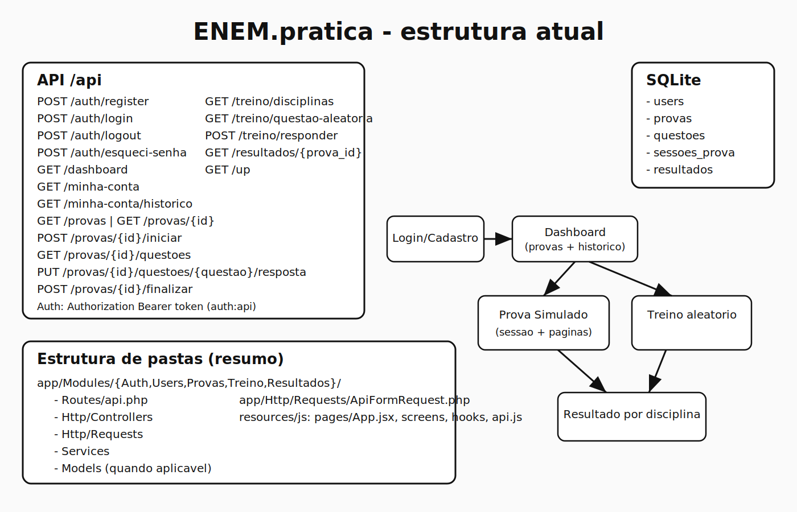

# 📚 ENEM.prática

Simulador de provas estilo ENEM com:
- **Backend:** Laravel 11 (API)
- **Frontend:** React 18 + Vite 6 (SPA)
- **Base de dados:** SQLite

## 🎯 Visão rápida

- Arquitetura modular por domínio em `app/Modules/{Auth,Users,Provas,Treino,Resultados}`.
- Autenticação com **Bearer token** (`auth:api`) e `api_token` em hash.
- Fluxos separados para **simulado** (sessão de prova) e **treino aleatório**.
- Contrato de erros padronizado (`message + error`) via handler global.
- Refactor recente para reduzir acoplamento:
  - `ActiveProvasCatalog`
  - `QuestaoRespostaEvaluator`
  - `DomainException`

## 🛠️ Stacks utilizadas

| Camada | Stack |
|------|------|
| Backend | PHP 8.2+, Laravel 11 |
| Frontend | React 18, Vite 6 |
| Base de dados | SQLite (`pdo_sqlite`) |
| Estilos | Tailwind CSS 3, PostCSS |
| Testes backend | PHPUnit 11 |
| Testes frontend | Vitest 3, Testing Library, jsdom |

## Ideia inicial x estrutura final

| 🖼️ Ideia inicial (rascunho) | Estrutura final (implementada) |
|--------------------------|----------------------------------|
|  |  |
| Rotas mais genéricas e desenho com mais camadas | Rotas orientadas por ação e módulos mais diretos |
| Fluxo macro: login → painel → prova/treino → resultado | Mesmo fluxo de negócio, com implementação mais enxuta |

As imagens estão em:
- `docs/images/ideia-inicial.png`
- `docs/images/arquitetura-final-atualizada.svg`

## Estrutura essencial

```txt
app/
  Modules/{Auth,Users,Provas,Treino,Resultados}/
    Routes/api.php
    Http/Controllers
    Http/Requests
    Services
    Models
  Http/Requests/ApiFormRequest.php
  Support/
    DomainException.php
    ActiveProvasCatalog.php
    QuestaoRespostaEvaluator.php

resources/js/
  pages/App.jsx
  screens/
  hooks/ (useAuthFlow, useNavigation, useProvaFlow, useTreinoFlow, useScopedAbort)
  components/
  api.js
```

## Endpoints principais

Prefixo: `/api`

### Auth
- `POST /auth/register`
- `POST /auth/login`
- `POST /auth/logout` (Bearer)
- `POST /auth/esqueci-senha`

### Utilizador
- `GET /dashboard` (Bearer)
- `GET /minha-conta` (Bearer)
- `GET /minha-conta/historico` (Bearer)

### Provas
- `GET /provas`
- `GET /provas/{id}`
- `POST /provas/{id}/iniciar` (Bearer)
- `GET /provas/{id}/questoes`
- `PUT /provas/{id}/questoes/{questao_id}/resposta` (Bearer)
- `POST /provas/{id}/finalizar` (Bearer)

### Treino
- `GET /treino/disciplinas`
- `GET /treino/questao-aleatoria`
- `POST /treino/responder` (Bearer)

### Resultados
- `GET /resultados/{prova_id}` (Bearer)

### Health
- `GET /up`

## Contrato de erro da API

- `422` validação: `error.code = VALIDATION_ERROR` e `error.details.fields`
- Erros HTTP: `error.code = HTTP_{status}` (ex.: `HTTP_401`, `HTTP_404`)
- `500`: `error.code = INTERNAL_ERROR`

## 🚀 Como rodar

### Pré-requisitos
- PHP 8.2+ (`pdo_sqlite`)
- Composer
- Node.js + npm

### Setup

```bash
composer install
cp .env.example .env
php artisan key:generate
```

No Windows (PowerShell), use:

```powershell
Copy-Item .env.example .env
php artisan key:generate
```

Criar SQLite:

```bash
touch database/database.sqlite
```

PowerShell:

```powershell
New-Item -ItemType File -Path database\database.sqlite -Force
```

Migrar e semear:

```bash
php artisan migrate:fresh --seed
npm install
```

Subir em desenvolvimento (2 terminais):

```bash
php artisan serve
npm run dev
```

## Conta demo

- Email: `maria@enem.dev`
- Senha: `123456`

> Para cadastro novo via API, senha precisa de no mínimo 8 caracteres com letras e números.

## Testes

```bash
php vendor/bin/phpunit
npm run test
```

Watch frontend:

```bash
npm run test:frontend:watch
```

